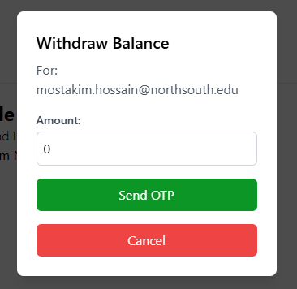

<p align="center">
  
</p>

# Smart Freelance Hub

> Connect with Talent, Hire with Ease.

Smart Freelance Hub is an innovative freelancing marketplace that leverages **machine learning** to deliver personalized freelancer recommendations. Unlike traditional platforms like Fiverr, Upwork, and Freelancer.com, Smart Freelance Hub emphasizes **inclusivity** by giving higher visibility to new freelancers while maintaining quality by also considering experienced professionals. When a client posts a job, the system analyzes requirements and generates a curated list of freelancers who best match the task—promoting newcomers alongside seasoned professionals. This unique approach ensures that new talent, who may struggle to gain traction on conventional platforms, is given more opportunities to thrive.


**North South University** · ECE Department · Junior Design Project · Summer 2024  
**Faculty Advisor:** Ms. Tanzilah Noor Shabnam

---

## ✨ Features

- **AI-Powered Matching** — ML-based similarity matching using NLP (spaCy) and cosine similarity to recommend freelancers that best fit project requirements
- **Inclusive Algorithm** — Promotes new freelancers (0 jobs completed) alongside experienced ones, leveling the playing field
- **Dual User Roles** — Support for Freelancers, Clients, and Both with tailored profiles and dashboards
- **Real-Time Messaging** — Socket.IO-powered chat for instant communication between clients and freelancers
- **Job Management** — Post jobs, submit proposals, manage contracts, and track progress
- **Portfolios & Skills** — Freelancers can showcase their work and skills; clients can browse and filter by expertise
- **Payment & Transactions** — Balance top-up, withdrawals, bKash integration, and transaction history
- **Reviews & Ratings** — Build reputation through client and freelancer feedback
- **Google OAuth** — Quick sign-up and login with Google
- **Email Verification** — OTP-based account verification via SendGrid/Nodemailer
- **File Uploads** — Profile pictures, portfolio items, and document attachments

---

## 📸 Screenshots

<p align="center">
  
</p>

| Login | Sign Up |
|-------|---------|
|  |  |

| Profile page freelancer | Profile page client |
|------------------------|---------------------|
|  |  |

| Job Post Modal | Job Offer |
|----------------|-----------|
|  |  |

| Freelancer Search Result | Freelancer Details View |
|--------------------------|-------------------------|
|  |  |

| New Job Alert | Payment details card |
|---------------|----------------------|
|  |  |

| Payment details entry bkash | Top Up | Withdraw |
|-----------------------------|--------|----------|
|  |  |  |

---

## 🗄 Database Design

The platform uses MongoDB with collections for Users, Jobs, Messages, Reviews, Payments, and Transactions. Below is the Entity-Relationship Diagram:

<p align="center">
  
</p>

---

## 🛠 Tech Stack

| Layer | Technologies |
|-------|--------------|
| **Frontend** | React, Vite, Tailwind CSS, DaisyUI, React Router, Socket.IO Client |
| **Backend** | Node.js, Express, MongoDB |
| **ML Backend** | Python, Flask, spaCy, scikit-learn |

---

## 📁 Project Structure

```
Smart-Freelance-Hub/
├── frontend-smart-freelance-hub/   # React + Vite frontend
│   ├── src/
│   │   ├── components/             # Reusable UI components
│   │   ├── pages/                  # Page components
│   │   └── utils/                  # Utility functions
│   └── ...
├── backend-smart-freelance-hub/    # Express.js REST API
│   ├── controller/                 # Business logic
│   ├── routes/                     # API routes
│   ├── models/                     # Data models
│   ├── database/                   # DB connection & schema
│   ├── utils/                      # Helpers (socket, OTP, etc.)
│   └── uploads/                    # Uploaded files
├── ml-backend-smart-freelance-hub/ # ML recommendation service
│   └── app.py                      # Flask + NLP similarity API
├── images/                         # Screenshots & diagrams
└── README.md
```

---

## 🚀 Getting Started

### Prerequisites

- **Node.js** (v18+)
- **Python** (3.8+)
- **MongoDB** (local or remote)
- **Git**

### 1. Clone the Repository

```bash
git clone https://github.com/your-username/Smart-Freelance-Hub.git
cd Smart-Freelance-Hub
```

### 2. Backend Setup

```bash
cd backend-smart-freelance-hub
npm install
```

Create a `.env` file in the backend directory:

```env
DATABASE_URL=mongodb://localhost:27017
DATABASE_NAME=SmartFreelanceHub
```

Run the backend:

```bash
npm run dev
```

The API runs at `http://localhost:3000`.

### 3. Frontend Setup

```bash
cd frontend-smart-freelance-hub
npm install
npm run dev
```

The app runs at `http://localhost:5173` (Vite default).

### 4. ML Backend Setup (Optional — for recommendations)

```bash
cd ml-backend-smart-freelance-hub
pip install flask flask-cors pymongo spacy scikit-learn numpy
python -m spacy download en_core_web_lg
```

Run the ML service:

```bash
python app.py
```

The ML API runs at `http://localhost:8000`.

---

## 🔧 Environment Variables

| Variable | Description | Where |
|----------|-------------|-------|
| `DATABASE_URL` | MongoDB connection string | Backend |
| `DATABASE_NAME` | MongoDB database name | Backend |
| Google OAuth Client ID | For Google sign-in | Frontend (in code) |

---

## ⚠ Limitations

1. **Limited Freelancer Rehiring** — Clients cannot directly rehire the same freelancer unless that individual appears in the recommendation system.
2. **Email/OTP Limits** — Email service imposes limits (e.g., 3,000/month for registration OTPs, 1,000/day for others).
3. **Portfolio Showcase** — Freelancers cannot upload and showcase portfolios or previous projects.
4. **Real-Time Updates** — New job alerts are not always updated in real time on the website.
5. **Local Device Dependency** — Certain functionalities depend on the user's device capabilities.

---

## 🔮 Future Improvements

- **Live Notifications** — Real-time website and mobile app notifications
- **Integrated Payments** — Secure payment gateways (e.g., bKash) for streamlined transactions
- **Advanced ML** — Incorporate language, country, region, and past work experience into the recommendation algorithm
- **Mobile App** — Dedicated mobile application for greater accessibility

---

## 📜 License

This project is licensed under the MIT License — see the [LICENSE](LICENSE) file for details.

---

## 🤝 Contributors

Thanks to everyone who contributed to Smart Freelance Hub!

<table>
  <tr>
    <td align="center">
      <a href="https://github.com/Raiyan27">
        
        <br />
        <sub><b>Raiyan27</b></sub>
      </a>
    </td>
    <td align="center">
      <a href="https://github.com/Crysis-Pixel">
        
        <br />
        <sub><b>Crysis-Pixel</b></sub>
      </a>
    </td>
    <td align="center">
      <a href="https://github.com/Mostakim52">
        
        <br />
        <sub><b>Mostakim52</b></sub>
      </a>
    </td>
  </tr>
</table>
